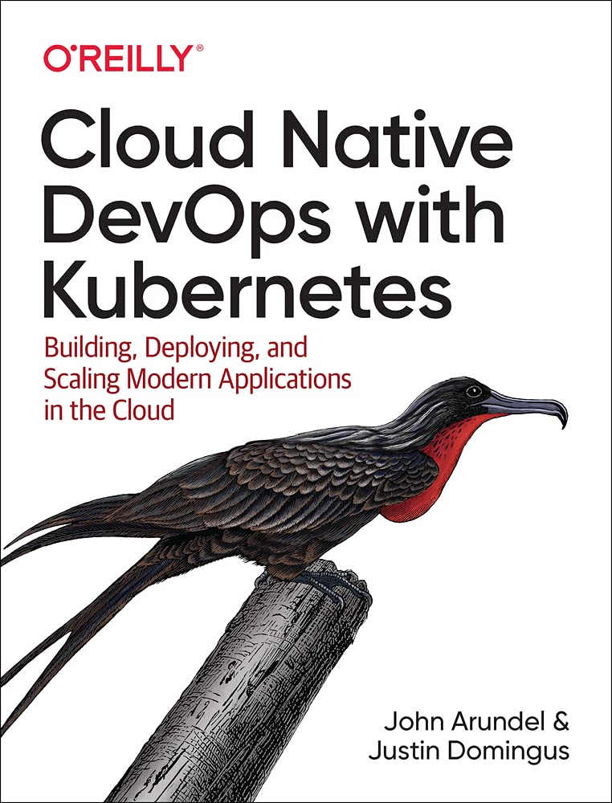

## Cloud Native DevOps with Kubernetes: Building, Deploying, and Scaling Modern Applications in the Cloud

### CHAPTER 1 - Revolution in the Cloud

- Cloud computing frees you from the expense and overhead of managing your own hardware, making it possible for you to build resilient, flexible, scalable distributed systems.
- DevOps is a recognition that modern software development doesn’t stop at shipping code: it’s about closing the feedback loop between those who write the code and those who use it.
- DevOps also brings a code-centric approach and good software engineering practices to the world of infrastructure and operations.
- Containers allow you to deploy and run software in small, standardized, selfcontained units. This makes it easier and cheaper to build large, diverse, distributed systems, by connecting together containerized microservices.
- Orchestration systems take care of deploying your containers, scheduling, scaling, networking, and all the things that a good system administrator would do, but in an automated, programmable way.
- Kubernetes is the de facto standard container orchestration system, and it’s ready for you to use in production right now, today.
- Cloud native is a useful shorthand for talking about cloud-based, containerized, distributed systems, made up of cooperating microservices, dynamically managed by automated infrastructure as code.
- Operations and infrastructure skills, far from being made obsolete by the cloud native revolution, are and will become more important than ever.
- It still makes sense for a central team to build and maintain the platforms and tools that make DevOps possible for all the other teams.
- What will go away is the sharp distinction between software engineers and operations engineers. It’s all just software now, and we’re all engineers.

### CHAPTER 2 - First Steps with Kubernetes

- The Docker tool lets you build containers locally, push them to or pull them from a container registry such as Docker Hub, and run container images locally on your machine.
- A container image is completely specified by a Dockerfile: a text file that contains instructions about how to build the container.
- Docker Desktop lets you run a small (single-node) Kubernetes cluster on your machine, which is nonetheless capable of running any containerized application. Minikube is another option.
- The kubectl tool is the primary way of interacting with a Kubernetes cluster, and can be used either imperatively (to run a public container image, for example, and implicitly creating the necessary Kubernetes resources), or declaratively, to apply Kubernetes configuration in the form of YAML manifests.

### CHAPTER 3 - Getting Kubernetes

- Kubernetes clusters are made up of master nodes, which run the control plane, and worker nodes, which run your workloads.
- Production clusters must be highly available, meaning that the failure of a master node won’t lose data or affect the operation of the cluster.
- It’s a long way from a simple demo cluster to one that’s ready for critical production workloads. High availability, security, and node management are just some of the issues involved.
- Managing your own clusters requires a significant investment of time, effort, and expertise. Even then, you can still get it wrong.
- Managed services like Google Kubernetes Engine do all the heavy lifting for you, at much lower cost than self-hosting.
- Turnkey services are a good compromise between self-hosted and fully managed Kubernetes. Turnkey providers like Stackpoint manage the master nodes for you, while you run worker nodes on your own machines.
- If you have to host your own cluster, kops is a mature and widely used tool that can provision and manage production-grade clusters on AWS and Google Cloud.
- You should use managed Kubernetes if you can. This is the best option for most businesses in terms of cost, overhead, and quality.
- If managed services aren’t an option, consider using turnkey services as a good compromise.
- Don’t self-host your cluster without sound business reasons. If you do self-host, don’t underestimate the engineering time involved for the initial setup and ongoing maintenance overhead.

### CHAPTER 4 - Working with Kubernetes Objects

- The Pod is the fundamental unit of work in Kubernetes, specifying a single container or group of communicating containers that are scheduled together.
- A Deployment is a high-level Kubernetes resource that declaratively manages Pods, deploying, scheduling, updating, and restarting them when necessary.
- A Service is the Kubernetes equivalent of a load balancer or proxy, routing traffic to its matching Pods via a single, well-known, durable IP address or DNS name.
- The Kubernetes scheduler watches for a Pod that isn’t yet running on any node, finds a suitable node for it, and instructs the kubelet on that node to run the Pod.
- Resources like Deployments are represented by records in Kubernetes’s internal database. Externally, these resources can be represented by text files (known as manifests) in YAML format. The manifest is a declaration of the desired state of the resource.
- kubectl is the main tool for interacting with Kubernetes, allowing you to apply manifests, query resources, make changes, delete resources, and do many other tasks.
- Helm is a Kubernetes package manager. It simplifies configuring and deploying Kubernetes applications, allowing you to use a single set of values (such as the application name or listen port) and a set of templates to generate Kubernetes YAML files, instead of having to maintain the raw YAML files yourself.

### CHAPTER 5 - Managing Resources

- Kubernetes allocates CPU and memory resources to containers on the basis of requests and limits.
- A container’s requests are the minimum amounts of resources it needs to run. Its limits specify the maximum amount it’s allowed to use.
- Minimal container images are faster to build, push, deploy, and start. The smaller the container, the fewer the potential security vulnerabilities.
- Liveness probes tell Kubernetes whether the container is working properly. If a container’s liveness probe fails, it will be killed and restarted.
- Readiness probes tell Kubernetes that the container is ready and able to serve requests. If the readiness probe fails, the container will be removed from any Services that reference it, disconnecting it from user traffic.
- PodDisruptionBudgets let you limit the number of Pods that can be stopped at once during evictions, preserving high availability for your application.
- Namespaces are a way of logically partitioning your cluster. You might create a namespace for each application, or group of related applications.
- To refer to a Service in another namespace, you can use a DNS address like this: SERVICE.NAMESPACE.
- ResourceQuotas let you set overall resource limits for a given namespace.
- LimitRanges specify default resource requests and limits for containers in a namespace.
- Set resource limits so that your applications almost, but don’t quite exceed them in normal usage.
- Don’t allocate more cloud storage than you need, and don’t provision highbandwidth storage unless it’s critical for your application’s performance.
- Set owner annotations on all your resources, and scan the cluster regularly for unowned resources.
- Find and clean up resources that aren’t being utilized (but check with their owners).
- Reserved instances can save you money if you can plan your usage long-term.
- Preemptible instances can save you money right now, but be ready for them to vanish at short notice. Use node affinities to keep failure-sensitive Pods away from preemptible nodes

### CHAPTER 6 - Operating Clusters

- Before provisioning your production Kubernetes cluster, think about how many nodes you’ll need, and of what size.
- You need at least three master nodes (none, if you’re using a managed service) and at least two (ideally three) worker nodes. This can make Kubernetes clusters seem a little expensive at first when you’re only running a few small workloads, but don’t forget the advantages of built-in resilience and scaling.
- Kubernetes clusters can scale to many thousands of nodes and hundreds of thousands of containers.
- If you need to scale beyond that, use multiple clusters (sometimes you need to do this for security or compliance reasons too). You can join clusters together using federation if you need to replicate workloads across clusters.
- A typical instance size for a Kubernetes node is 1 CPU, 4 GiB RAM. It’s good to have a mix of a few different node sizes, though.
- Kubernetes isn’t just for the cloud; it runs on bare-metal servers too. If you’ve got metal sitting around, why not use it?
- You can scale your cluster up and down manually without too much trouble, and you probably won’t have to do it very often. Autoscaling is nice to have, but not that important.
- There’s a well-defined standard for Kubernetes vendors and products: the CNCF Certified Kubernetes mark. If you don’t see this, ask why not.
- Chaos testing is a process of knocking out Pods at random and seeing if your application still works. It’s useful, but the cloud has a way of doing its own chaos testing anyway, without you asking for it.

### CHAPTER 7 - Kubernetes Power Tools

- kubectl includes complete and exhaustive documentation on itself, available with kubectl -h, and on every Kubernetes resource, field, or feature, using kubectl explain.
- When you want to do complicated filtering and transformations on kubectl output, for example in scripts, select JSON format with -o json. Once you have JSON data, you can use power tools like jq to query it.
- The --dry-run option to kubectl, combined with -o YAML to get YAML output, lets you use imperative commands to generate Kubernetes manifests. This is a big time-saver when creating manifest files for new applications, for example.
- You can turn existing resources into YAML manifests, too, using the --export flag to kubectl get.
- kubectl diff will tell you what would change if you applied a manifest, without actually changing it.
- You can see the output and error messages from any container with kubectl logs, stream them continuously with the --follow flag, or do more sophisticated multi-Pod log tailing with Stern.
- To troubleshoot problem containers, you can attach to them with kubectl attach or get a shell on the container with kubectl exec -it ... /bin/sh.
- You can run any public container image with kubectl run to help solve problems, including the multitalented BusyBox tool, which contains all your favorite Unix commands.
- Kubernetes contexts are like bookmarks, marking your place in a particular cluster and namespace. You can switch conveniently between contexts and namespaces using the kubectx and kubens tools.
- Click is a powerful Kubernetes shell that gives you all the functionality of kubectl, but with added state: it remembers the currently selected object from one command to the next, so you don’t have to specify it every time.
- Kubernetes is designed to be automated and controlled by code. When you need to go beyond what kubectl provides, the Kubernetes client-go library gives you complete control over every aspect of your cluster using Go code.

### CHAPTER 8 - Running Containers

- A Linux container, at the kernel level, is an isolated set of processes, with ringfenced resources. From inside a container, it looks as though the container has a Linux machine to itself.
- Containers are not virtual machines. Each container should run one primary process.
- A Pod usually contains one container that runs a primary application, plus optional helper containers that support it.
- Container image specifications can include a registry hostname, a repository namespace, an image repository, and a tag; for example docker.io/cloudnatived/demo:hello. Only the image name is required.
- For reproducible deployments, always specify a tag for the container image. Otherwise, you’ll get whatever happens to be latest.
- Programs in containers should not run as the root user. Instead, assign them an ordinary user.
- You can set the runAsNonRoot: true field on a container to block any container that wants to run as root.
- Other useful security settings on containers include readOnlyRootFilesystem: true and allowPrivilegeEscalation: false.
- Linux capabilities provide a fine-grained privilege control mechanism, but the default capabilities for containers are too generous. Start by dropping all capabilities for containers, then grant specific capabilities if a container needs them.
- Containers in the same Pod can share data by reading and writing a mounted Volume. The simplest Volume is of type emptyDir, which starts out empty and preserves its contents only as long as the Pod is running.
- A PersistentVolume, on the other hand, preserves its contents as long as needed. Pods can dynamically provision new PersistentVolumes using PersistentVolumeClaims.

### CHAPTER 9 - Managing Pods

- Labels are key-value pairs that identify resources, and can be used with selectors to match a specified group of resources.
- Node affinities attract or repel Pods to or from nodes with specified attributes. For example, you can specify that a Pod can only run on a node in a specified availability zone.
- While hard node affinities can block a Pod from running, soft node affinities are more like suggestions to the scheduler. You can combine multiple soft affinities with different weights.
- Pod affinities express a preference for Pods to be scheduled on the same node as other Pods. For example, Pods that benefit from running on the same node can express that using a Pod affinity for each other.
- Pod anti-affinities repel other Pods instead of attracting. For example, an antiaffinity to replicas of the same Pod can help spread your replicas evenly across the cluster.
- Taints are a way of tagging nodes with specific information; usually, about node problems or failures. By default, Pods won’t be scheduled on tainted nodes.
- Tolerations allow a Pod to be scheduled on nodes with a specific taint. You can use this mechanism to run certain Pods only on dedicated nodes.
- DaemonSets allow you to schedule one copy of a Pod on every node (for example, a logging agent).
- StatefulSets start and stop Pod replicas in a specific numbered sequence, allowing you to address each by a predictable DNS name. This is ideal for clustered applications, such as databases.
- Jobs run a Pod once (or a specified number of times) before completing. Similarly, Cronjobs run a Pod periodically at specified times.
- Horizontal Pod Autoscalers watch a set of Pods, trying to optimize a given metric (such as CPU utilization). They increase or decrease the desired number of replicas to achieve the specified goal.
- PodPresets can inject bits of common configuration into all selected Pods at creation time. For example, you could use a PodPreset to mount a particular Volume on all matching Pods.
- Custom Resource Definitions (CRDs) allow you to create your own custom Kubernetes objects, to store any data you wish. Operators are Kubernetes client programs that can implement orchestration behavior for your specific application (for example, MySQL).
- Ingress resources route requests to different services, depending on a set of rules, for example, matching parts of the request URL. They can also terminate TLS connections for your application.
- Istio is a tool that provides advanced networking features for microservice applications and can be installed, like any Kubernetes application, using Helm.
- Envoy provides more sophisticated load balancing features than standard cloud load balancers, as well as a service mesh facility.

### CHAPTER 10 - Configuration and Secrets

- Separate your configuration data from application code and deploy it using Kubernetes ConfigMaps and Secrets. That way, you don’t need to redeploy your app every time you change a password.
- You can get data into ConfigMaps by writing it directly in your Kubernetes manifest file, or use kubectl to convert an existing YAML file into a ConfigMap spec.
- Once data is in a ConfigMap, you can insert it into a container’s environment, or into the command-line arguments of its entrypoint. Alternatively, you can write the data to a file that is mounted on the container.
- Secrets work just like ConfigMaps, except that the data is encrypted at rest, and obfuscated in kubectl output.
- A simple and flexible way to manage secrets is to store them directly in your source code repo, but encrypt them using Sops, or another text-based encryption tool.
- Don’t overthink secrets management, especially at first. Start with something simple that’s easy to set up for developers.
- Where secrets are shared by many applications, you can store them (encrypted) in a cloud bucket, and fetch them at deploy time.
- For enterprise-level secrets management, you’ll need a dedicated service such as Vault. But don’t start with Vault, because you may end up not needing it. You can always move to Vault later.
- Sops is an encryption tool that works with key-value files like YAML and JSON. It can get its encryption key from a local GnuPG keyring, or cloud key management services like Amazon KMS and Google Cloud KMS.

### CHAPTER 11 - Security and Backups

- Role-Based Access Control (RBAC) gives you fine-grained management of permissions in Kubernetes. Make sure it’s enabled, and use RBAC roles to grant specific users and apps only the minimum privileges they need to do their jobs.
- Containers aren’t magically exempt from security and malware problems. Use a scanning tool to check any containers you run in production.
- Kubernetes is great and all, but you still need backups. Use Velero to back up your data and the state of the cluster. It’s handy for moving things between clusters, too.
- kubectl is a powerful tool for inspecting and reporting on all aspects of your cluster and its workloads. Get friendly with kubectl. You’ll be spending a lot of time together.
- Use your Kubernetes provider’s web console and kube-ops-view for a graphical overview of what’s going on. If you use the Kubernetes Dashboard, secure it as tightly as you would your cloud credentials and crypto keys.

### CHAPTER 12 - Deploying Kubernetes Applications

- A chart is a Helm package specification, including metadata about the package, some configuration values for it, and template Kubernetes objects that reference those values.
- Installing a chart creates a Helm release. Each time you install an instance of a chart, a new release is created. When you update a release with different config values, Helm increments the release revision number.
- To customize a Helm chart for your own requirements, create a custom values file overriding just the settings you care about, and add it to the helm install or helm upgrade command line.
- You can use a variable (environment, for example) to select different sets of values or secrets depending on the deployment environment: staging, production, and so on.
- With Helmfile, you can declaratively specify a set of Helm charts and values to be applied to your cluster, and install or update all of them with a single command.
- Helm can be used along with Sops for handling secret configuration in your charts. It can also use a function to automatically base64-encode your secrets, which Kubernetes expects them to be.
- Helm is not the only available tool for managing Kubernetes manifests. Ksonnet and Kapitan use Jsonnet, a different templating language. kustomize takes a different approach and rather than interpolating variables, it just uses YAML overlays to configure manifests.
- A quick way to test and validate manifests is to use kubeval, which will check for valid syntax and common errors in manifests.

### CHAPTER 13 - Development Workflow

- The default RollingUpdate deployment strategy in Kubernetes upgrades a few Pods at a time, waiting for each replacement Pod to become ready before shutting down the old one.
- Rolling updates avoid downtime, at the expense of making the rollout take longer. It also means that both old and new versions of your application will be running simultaneously during the rollout period.
- You can adjust the maxSurge and maxUnavailable fields to fine-tune rolling updates. Depending on the versions of the Kubernetes API you are using, the defaults may or may not be appropriate for your situation.
- The Recreate strategy just blows away all the old Pods and starts up new ones all at once. This is fast, but results in downtime, so it’s not suitable for user-facing applications.
- In a blue/green deployment, all the new Pods are started up and made ready without receiving any user traffic. Then all traffic is switched over to the new Pods in one go, before retiring the old Pods.
- Rainbow deployments are similar to blue/green deployments, but with more than two versions in service simultaneously.
- You can implement blue/green and rainbow deployments in Kubernetes by adjusting the labels on your Pods and changing the selector on the front-end Service to direct traffic to the appropriate set of Pods.
- Helm hooks provide a way to apply certain Kubernetes resources (usually Jobs) at a particular stage of a deployment, for example, to run a database migration. Hooks can define the order in which resources should be applied during a deployment, and cause the deployment to halt if something does not succeed.

### CHAPTER 14 - Continuous Deployment in Kubernetes

- Deciding which CD tools to use is an important process when building a new pipeline. All of the tools we mention throughout this book could likely be incorporated into almost any existing CD tool.
- Jenkins, GitLab, Drone, Cloud Build, and Spinnaker are just a few of the popular CD tools that work well with Kubernetes. There are also many newer tools such as Gitkube, Flux, and Keel that are specifically built for automating deployments to Kubernetes clusters.
- Defining the build pipeline steps with code allows you to track and modify these steps alongside application code.
- Containers enable developers to promote build artifacts up through environments, such as testing, staging, and eventually production, ideally without having to rebuild a new container.
- Our example pipeline using Cloud Build should be easily adaptable for other tools and types of applications. The overall build, test, and deploy steps are largely the same in any CD pipeline, regardless of the tools used or type of software.

### CHAPTER 15 - Observability and Monitoring

- Black-box monitoring checks observe the external behavior of a system, to detect predictable failures.
- Distributed systems expose the limitations of traditional monitoring, because they’re not in either up or down states: they exist in a constant state of partially degraded service. In other words, nothing is ever completely right aboard a ship.
- Logs can be useful for post-incident troubleshooting, but they’re hard to scale.
- Metrics open up a new dimension beyond simply working/not working, and give you continuous numerical time-series data on hundreds or thousands of aspects of your system.
- Metrics can help you answer the why question, as well as identify problematic trends before they lead to outages.
- Tracing records events with precise timing through the life cycle of an individual request, to help you debug performance problems.
- Observability is the union of traditional monitoring, logging, metrics, and tracing, and all the other ways you can understand your system.
- Observability also represents a shift toward a team culture of engineering based on facts and feedback.
- It’s still important to check that your user-facing services are up, with external black-box checks, but don’t try to build your own: use a third-party monitoring service like Uptime Robot.
- Nines don’t matter if users aren’t happy

### CHAPTER 16 - Metrics in Kubernetes

- Focus on the key metrics for each service: requests, errors, and duration (RED). For each resource: utilization, saturation, and errors (USE).
- Instrument your apps to expose custom metrics, both for internal observability, and for business KPIs.
- Useful Kubernetes metrics include, at the cluster level, the number of nodes, Pods per node, and resource usage of nodes.
- At the deployment level, track deployments and replicas, especially unavailable replicas, which might indicate a capacity problem.
- At the container level, track resource usage per container, liveness/readiness states, restarts, network traffic, and network errors.
- Build a dashboard for each service, using a standard layout, and a master information radiator that reports the vital signs of the whole system.
- If you alert on metrics, alerts should be urgent, important, and actionable. Alert noise creates fatigue and damages morale.
- Track and review the number of urgent pages your team receives, especially wake-ups and weekends.
- The de facto standard metrics solution in the cloud native world is Prometheus, and almost everything speaks the Prometheus data format.
- Third-party managed metrics services include Google Stackdriver, Amazon Cloudwatch, Datadog, and New Relic.
